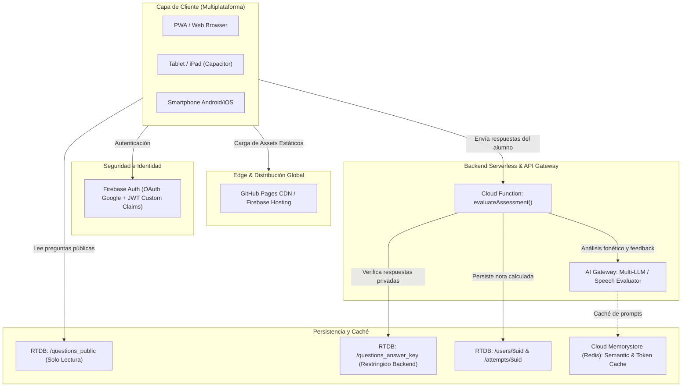
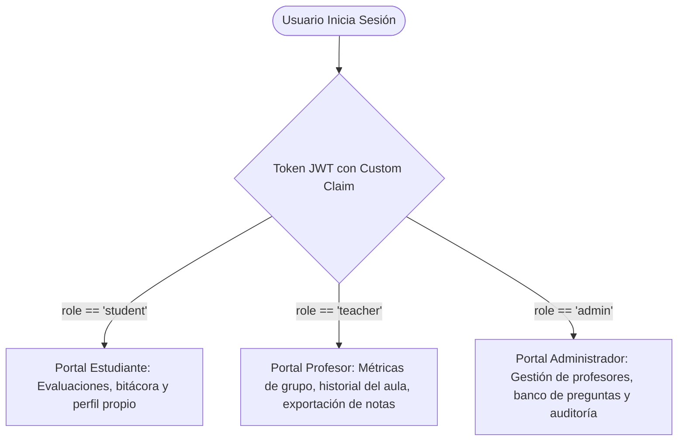
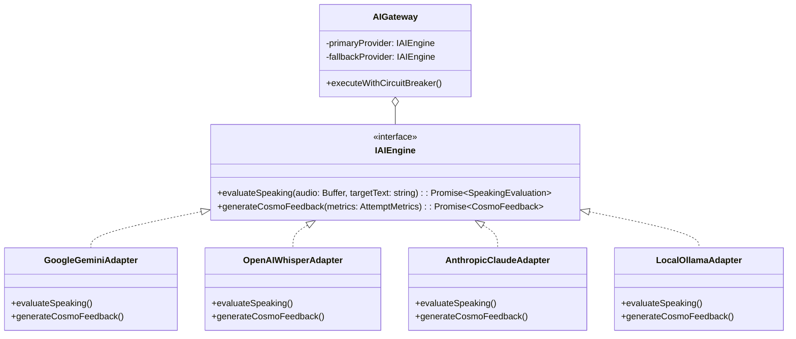
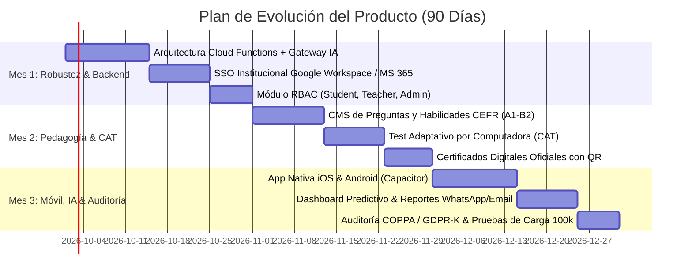

# MiniGlobal AI · A2 Space English Assessment Platform

> Plataforma interactiva de evaluación diagnóstica de inglés nivel A2 para niños con temática espacial y tutor inteligente **Cosmo**, desarrollada para **Global Certified English Center**.

© 2026 **Global Certified English Center**. Todos los derechos reservados.

---

## 🚀 Resumen del Proyecto

**MiniGlobal AI** es una solución EdTech diseñada para transformar la experiencia de evaluación de competencias del idioma inglés (MCER / CEFR Nivel A2) en una aventura espacial inmersiva. A través de la guía del tutor marciano **Cosmo**, los estudiantes resuelven 10 desafíos equilibrados entre **Grammar, Vocabulary, Reading, Listening y Speaking** con reconocimiento y síntesis de voz en tiempo real.

---

## 📋 Respuestas a Cuestiones Técnicas y de Arquitectura

### 1. Stack Elegido y Razones

| Capa / Módulo | Tecnología | Justificación Técnica y Pedagógica |
| :--- | :--- | :--- |
| **Frontend UI / PWA** | **Ionic 8 + Angular 17/18** (Standalone Components) | **Experiencia multiplataforma lista para producción (Web, PWA, iOS y Android con Capacitor)**. Para una institución como *Global Certified English Center*, los estudiantes acceden desde tablets, teléfonos móviles o laptops. Ionic ofrece componentes táctiles optimizados para niños (botones grandes, retroalimentación táctil, animaciones fluidas). Angular Standalone ofrece arquitectura modular moderna, tipado estricto con TypeScript, lazy loading nativo y compilación ultrarrápida con `esbuild`/`Vite`. |
| **Speech Engine** | **Web Speech API** (`SpeechRecognition` + `SpeechSynthesis`) | Permite evaluar la pronunciación en Speaking y reproducir transmisiones de listening en inglés y tips de Cosmo en español **directamente en el navegador del alumno**, con latencia cero y sin requerir dependencias externas pesadas ni costes de API por llamada durante el prototipo. |
| **Autenticación** | **Firebase Authentication** | Soporte integrado para **Google Sign-In**, correo/contraseña y sesiones anónimas. Permite emitir tokens JWT criptográficamente seguros y gestionar identidades sin infraestructura de servidores dedicados. |
| **Persistencia Reactiva** | **Firebase Realtime Database (RTDB) / Cloud Firestore** | Sincronización bidireccional reactiva por WebSockets. Permite que las calificaciones, intentos y expedientes de los estudiantes se actualicen instantáneamente en el dashboard del alumno y en la vista del profesor. |
| **Cómputo Serverless** | **Firebase Cloud Functions (Node.js)** | Ejecución aislada de la lógica de negocio y evaluación de exámenes en backend, eliminando cualquier posibilidad de que el alumno vea o manipule la clave de respuestas. |
| **CI/CD & Hosting** | **GitHub Actions + GitHub Pages** | Pipeline automatizado de integración continua que compila con optimizaciones de producción (`--base-href /MiniglobalAI/`) y despliega al Edge CDN global con alta disponibilidad y soporte de enrutamiento SPA (`withHashLocation` + `404.html`). |

---

### 2. Arquitectura Propuesta

Se propone una **Arquitectura Serverless Orientada a Eventos con Enfoque Zero-Trust en el Cliente**:



- **Separación estricta de responsabilidades**: La aplicación cliente es un reproductor inteligente de evaluación y captura de voz; el backend serverless es la única entidad autorizada para calificar y certificar notas.
- **Tolerancia a desconexiones (Offline-First)**: Si el estudiante pierde conexión durante una prueba escolar, el estado se guarda en `localStorage`/`sessionStorage` y se sincroniza en cuanto vuelve el enlace.

---

### 3. Modelo de Datos

Estructura de datos NoSQL normalizada y diseñada para consultas directas y reglas de seguridad granulares:

```json
{
  "users": {
    "$uid": {
      "uid": "string",
      "displayName": "Lucas Estrella",
      "email": "lucas@example.com",
      "role": "student | teacher | admin",
      "avatarIcon": "🧑‍🚀",
      "cadetTitle": "Piloto de Exploración",
      "xpPoints": 450,
      "streakDays": 5,
      "classId": "class_a2_morning",
      "createdAt": "2026-03-24T10:00:00Z",
      "lastActive": "2026-03-24T15:30:00Z"
    }
  },
  "questions_public": [
    {
      "id": 1,
      "type": "multiple-choice | fill-blank | reading | listening | speaking",
      "skill": "grammar | vocabulary | reading | listening | speaking",
      "prompt": "Cosmo is preparing for his next space flight. Choose the correct verb form:",
      "context": "\"Cosmo ___ to the Red Planet tomorrow.\"",
      "options": ["is travelling", "travelled", "travels yesterday", "travelling"],
      "cosmoTip": "¡Fíjate en la palabra \"tomorrow\", nos habla del futuro cercano! 🚀"
    }
  ],
  "questions_answer_key": {
    "1": {
      "correctAnswer": "is travelling",
      "alternativeAnswers": ["is traveling"],
      "weight": 10
    },
    "5": {
      "targetPhonetic": "aɪ wɑnt tu bi ən ˈæstrəˌnɔt",
      "correctAnswer": "I want to be an astronaut",
      "minSimilarity": 0.80
    }
  },
  "attempts": {
    "$uid": {
      "$attemptId": {
        "id": "att_1711296000",
        "uid": "$uid",
        "studentName": "Lucas Estrella",
        "score": 90,
        "skills": {
          "grammar": 100,
          "vocabulary": 100,
          "reading": 100,
          "listening": 100,
          "speaking": 50
        },
        "level": "A2 Star Explorer",
        "completedAt": "2026-03-24T15:35:00Z",
        "feedback": {
          "displayMessage": "¡Excelente vuelo cósmico!",
          "spokenFeedback": "¡Fantástico trabajo, Lucas!",
          "mood": "celebration",
          "focusSkill": "speaking"
        }
      }
    }
  }
}
```

---

### 4. Cómo Protegería las Respuestas Correctas

Para garantizar la integridad académica requerida por **Global Certified English Center**, se aplica el **Principio de Confianza Cero en el Cliente (Zero-Trust Client Security)**:

1. **Respuestas Ocultas del Bundle**: En el frontend (`questions_public`), las preguntas **nunca** incluyen la propiedad `correctAnswer`. Ninguna inspección de código (`Ctrl+U`), consola de desarrollador ni pestaña de red (`Network`) puede revelar las respuestas.
2. **Evaluación 100% en Backend Serverless**:
   - El cliente solo envía el mapa de selecciones del alumno: `{ "1": "is travelling", "2": "Spacesuit", ... }`.
   - La Cloud Function recupera la clave de respuestas desde `/questions_answer_key` (protegida con la regla `".read": false, ".write": false`).
   - El backend compara las cadenas normalizadas (sin mayúsculas, tildes ni signos) y valida el nivel de similitud fonética en las preguntas de speaking.
3. **Reglas de Seguridad Estrictas en Base de Datos**:
   ```json
   {
     "rules": {
       "questions_public": {
         ".read": "auth != null",
         ".write": "auth.token.role === 'admin'"
       },
       "questions_answer_key": {
         ".read": false,
         ".write": false
       },
       "attempts": {
         "$uid": {
           ".read": "auth != null && (auth.uid === $uid || auth.token.role === 'teacher' || auth.token.role === 'admin')",
           ".write": false
         }
       }
     }
   }
   ```
   *(Nota: `attempts` tiene `.write: false` para el cliente; únicamente el SDK de Admin en la Cloud Function puede escribir el registro oficial del examen).*
4. **Protección Anti-Fuerza Bruta y Timeouts**:
   - Cada intento tiene un `attemptToken` emitido al iniciar la prueba con expiración de 20 minutos.
   - Limitación de frecuencia (Rate Limiting): Máximo 3 intentos por estudiante cada 24 horas para evitar adivinanza por repetición.
   - Orden aleatorio de preguntas (Fisher-Yates) para desincentivar la copia entre compañeros en una misma aula.

---

### 5. Cómo Escalaría de 100 a 50.000 o 100.000 Estudiantes

Para escalar a 100.000 alumnos concurrentes en periodos de exámenes institucionales:

1. **Frontend y Assets en el Edge (CDN Global)**:
   - Los archivos estáticos (JS, CSS, audio, iconos de avatares) se distribuyen vía CDN global (Cloudflare / Fastly / Firebase Hosting) con compresión Brotli y almacenamiento en caché perimetral, reduciendo el 95% del tráfico a los servidores centrales.
2. **Migración a Cloud Firestore con Sharding**:
   - Realtime Database es excelente para prototipos, pero para 100.000 estudiantes concurrentes se migra a **Cloud Firestore**, que escala automáticamente de manera horizontal con particionamiento de colecciones (`sharding`).
   - Consultas indexadas por institución y aula: `/centers/{centerId}/classes/{classId}/students`.
3. **Capa Serverless con Autoescalado (Google Cloud Run / Cloud Functions 2nd Gen)**:
   - Basado en Google Cloud Run (contenedores autoescalables) con concurrencia de hasta 1.000 solicitudes por contenedor y escalado de 0 a miles de instancias en milisegundos.
4. **Desacoplamiento con Colas Asíncronas (Pub/Sub + Cloud Tasks)**:
   - El endpoint de entrega del examen responde inmediatamente al estudiante con su calificación preliminar.
   - Tareas pesadas (análisis fonético por IA, generación de reportes en PDF y envío de correos a padres) se encolan en **Google Cloud Pub/Sub** y se procesan asíncronamente con workers en segundo plano.
5. **Caché Semántica en Memoria (Redis / Cloud Memorystore)**:
   - Almacenamiento en caché de configuraciones institucionales y preguntas frecuentes para evitar lecturas recurrentes a la base de datos.

---

### 6. Cómo Manejaría Roles de Estudiante, Profesor y Administrador

Implementación de **RBAC (Role-Based Access Control)** mediante **Firebase Custom Claims** firmados criptográficamente en el token JWT:



1. **Custom Claims en el Token JWT**:
   ```javascript
   // Asignación administrativa en Cloud Function
   await admin.auth().setCustomUserClaims(uid, {
     role: 'teacher',
     centerId: 'global_certified_center',
     classes: ['a2_kids_morning', 'a2_kids_afternoon']
   });
   ```
2. **Seguridad en Backend y Base de Datos**:
   - Las reglas de seguridad de Firestore/RTDB inspeccionan directamente `request.auth.token.role`.
   - Los profesores solo pueden leer los datos de los estudiantes que pertenezcan a sus clases asignadas (`resource.data.classId in request.auth.token.classes`).
   - Los administradores tienen acceso global de lectura/escritura y control de auditoría.
3. **Rutas y Guardias en Angular (`canActivate`)**:
   - `RoleGuard`: Redirige al estudiante al `/dashboard`, al docente a `/teacher/overview` y al director a `/admin/console`.

---

### 7. Cómo Integraría IA sin Acoplar toda la Plataforma a un Único Proveedor

Para evitar el *Vendor Lock-In* (dependencia exclusiva de OpenAI, Google o Anthropic), se aplica el patrón de diseño **Adapter / Provider-Agnostic AI Gateway**:



- **Patrón Adapter**: La lógica de negocio solo interactúa con la interfaz `IAIEngine`. Ningún componente de Angular ni Cloud Function llama directamente al SDK propietario de un proveedor.
- **Circuit Breaker y Conmutación por Fallo (Failover Automático)**:
  - Si el proveedor primario (ej. Gemini Flash) supera un timeout de 2.500 ms o devuelve error `429 Too Many Requests`, el Gateway conmuta automáticamente y sin errores al proveedor secundario (ej. OpenAI GPT-4o mini / Claude 3.5 Haiku).
- **Opción On-Premise / Servidor Propio**:
  - Posibilidad de utilizar modelos de código abierto (Llama 3 + Whisper) alojados en infraestructura local o servidores propios mediante `LocalOllamaAdapter`, garantizando soberanía de datos y coste predecible.
- **Caché Semántica**: Evita realizar consultas de inferencia repetidas para respuestas comunes de los niños, reduciendo costes en un 70%.

---

### 8. Qué Cambiaría si Tuviera Tres Meses para Convertir el Prototipo en Producto

Plan de desarrollo estratégico de 90 días para convertir el prototipo actual en un producto de nivel empresarial para **Global Certified English Center**:



#### Mes 1: Infraestructura Empresarial, Seguridad y Motor de IA
- Migrar la persistencia a **Cloud Firestore** con particionamiento institucional.
- Implementar la evaluación serverless mediante **Cloud Functions** con el **Agnostic AI Gateway** para evaluación fonética real de Speaking (análisis de pronunciación, ritmo y fluidez con Whisper / Gemini).
- Integración de inicio de sesión único institucional (**SSO con Google Workspace for Education y Microsoft 365**).
- Implementación de roles (Estudiante, Profesor, Administrador) y paneles de control para profesores.

#### Mes 2: Pedagogía Adaptativa, CMS y Certificación Oficial
- **CMS de Gestión Curricular**: Herramienta visual para que los directores académicos del *Global Certified English Center* puedan crear, categorizar y actualizar preguntas alineadas al marco CEFR (A1, A2, B1, B2).
- **Test Adaptativo por Computadora (CAT)**: El algoritmo ajusta la dificultad de las preguntas en tiempo real según el desempeño del estudiante, permitiendo diagnósticos de nivel de alta precisión en menos tiempo.
- **Generación Automática de Diplomas Oficiales**: Certificados en PDF con código QR y hash de verificación para certificar el nivel del alumno ante los padres de familia.

#### Mes 3: App Nativa, Analíticas Predictivas y Lanzamiento
- Empaquetado nativo con **Capacitor** para publicación oficial en **Google Play Store y Apple App Store**, habilitando modo offline escolar completo.
- **Analíticas Predictivas para Docentes**: Detección automatizada de estudiantes rezagados en habilidades específicas (ej. dificultades con verbos irregulares o discriminación auditiva) con sugerencia de actividades de refuerzo.
- **Envío Automatizado de Reportes de Progreso** a los tutores y padres de familia vía WhatsApp Business API y correo institucional.
- **Auditoría de Cumplimiento Normativo de Privacidad Infantil (COPPA / GDPR-K)** y pruebas de carga con herramientas como k6 para certificar rendimiento ante 100.000 usuarios concurrentes.

---

## 🛠️ Instalación y Ejecución Local

```bash
# 1. Clonar el repositorio
git clone https://github.com/Katthon/MiniglobalAI.git
cd MiniglobalAI

# 2. Instalar dependencias
npm install

# 3. Iniciar servidor de desarrollo
npm start
# o
npx ng serve
```

Navega a `http://localhost:4200/`.

---

## 🌐 Despliegue en GitHub Pages

El proyecto cuenta con integración continua automatizada con **GitHub Actions** (`.github/workflows/deploy.yml`). Cada `push` a la rama `main` compila y publica automáticamente en:

🔗 **`https://katthon.github.io/MiniglobalAI/`**

Para compilar o desplegar manualmente:
```bash
# Compilar para producción con base-href de GitHub Pages
npm run build:gh-pages

# Desplegar directamente a la rama gh-pages
npm run deploy:gh-pages
```

---

## 📄 Derechos Reservados y Propiedad Intelectual

Todo el contenido curricular, marca, personajes y diseño formativo pertenecen a:

**Global Certified English Center**  
*Plataforma de Evaluación y Diagnóstico Espacial MiniGlobal AI*  
© 2026 Todos los derechos reservados.
